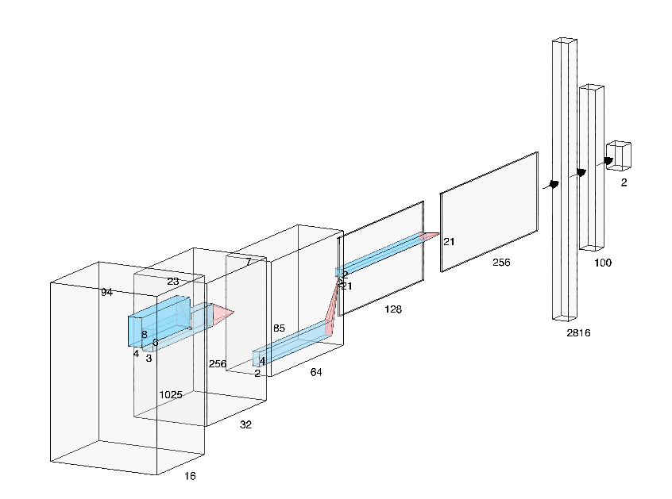
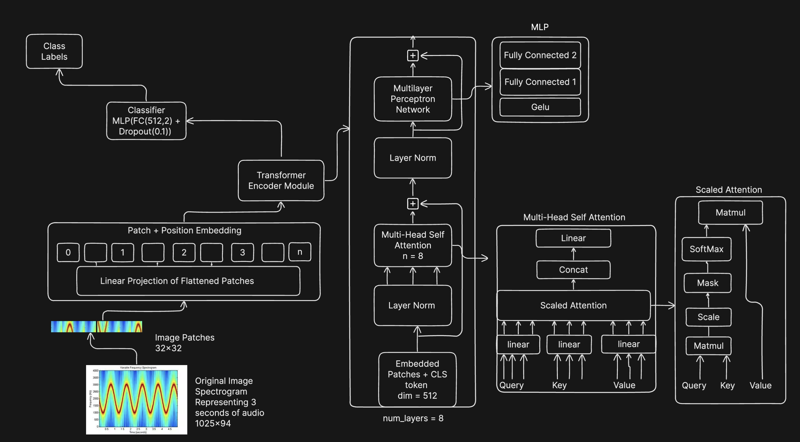

# Audio Deepfake Detection 
### Vision Transformers vs Convolutional Networks For Fast & Accurate Audio Deepfake Detection Applications

## Overview 
Ai-SPY is a company that focuses on deepfake detection for a better more genuine internet. This repo provides access to pretrained_weights for a convolutional net and vision transformer so you can check your own audio files for deepfakes. You can also train your own model and evaluate it with the code in this repo. 

## Installation
To get started, make sure you have Python 3.10+ installed. You can check your Python version with:
```bash
python --version
```
If you don't have Python 3.10+ installed, you can download it from [python.org](https://www.python.org). 

Clone the repository and install the required packages:

```bash
git clone https://github.com/yourusername/audio-deepfake-detection.git
cd Ai-SPY-Deepfake-Detection-Model
pip install -r requirements.txt

```

## Usage

### Using Pre-Trained Weights to Make a Prediction:
To run the model on a single file, you need to clone the repo using the instructions above then, from the base directory of the repo, run:
```bash
python -m src.inference_CNN <path to an mp3 file>
```
Results will look like this:
```bash
{
  "name": "/your/path/to/the/file/bradmondonyc_0851551530_musicaldown.com_37k_22050_1ch.mp3",
  "Percent_AI": 0.0,
  "Percent_Human": 100.0,
  "Prediction": "human"
}
```
To run the model on an entire directory, you need to adjust the following code in inference_CNN.py:
```python
     human_dirs = [
          
          ["data/human_split", "split human set"],
     ]

     ai_dirs = [
          
          ["data/ai_split", "split AI set"],
     ]

```
Place the path to your directory in either human_dirs or ai_dirs. This was initially built to test how it performed on known human or ai files so the final_results in the CNN_logs will not be accurate. However, the console will print out the prediction for each file in the directory upon running this. Once you have updated the paths above, you just need to run:

```bash
python -m src.inference_CNN
```

You can do the exact same thing with the vision transformer, pointing to a single file or an entire directory by running:
```bash
python -m src.inference_ViT <path to your file>
```
or
```bash
python -m src.inference_ViT
```
After adjusting the paths in inference_ViT.py.


## Training

### CNN Model Architecture:


The input is a 1025 x 94 spectrogram that represents 3 seconds of audio at 16,000 sample rate and 48,000 kbps bit rate. It goes through 5 convolutional layers, each with batchnorming and maxpooling then is flattened to a fully connected layer, then another that outputs 2 classes. Other architectures have been tried including resnet, and densenet but performance improvements were not pronounced, particularly when establishing speed and compute needed for inference as an important consideration for practical applications. 


## Vision Transformer Architecture:


The vision transformer is a standard Vit architecture. Others have experiemented with Siamese networks as a preprocessing step, but this adds computational overhead and doesn't have a clear performance improvement when used for practical applications. 

### Dataset & Data Preparation:

#### A Note on Dataset and Data Quality For Training:
This repo does not come with sample data. To train your own model, you need to supply your own dataset. These can be found all over the internet, but [this one is fairly robust](https://www.kaggle.com/datasets/birdy654/deep-voice-deepfake-voice-recognition). Your dataset must contain a human generated half and an AI-generated half

It is important to note however, that for practical applications, the quality of your dataset is very important. Both convolutional neural networks and vision transformers can generalize to a degree, but each deepfake production model has a slightly different signal/signature. These signals get less pronounced over time as these models become more sophisticated. So, consistently revisiting your dataset, how recently the data has been produced and the total composition of the dataset (ideally aiming for an equal representation of samples from the best models) is a very good idea. 

Ideally, you want the AI half of your dataset to be comprised of the latest and most performant deepfake models in equal balance. You should also seek as many "in the wild" examples from the internet as possible. These deepfakes often contain important additional noise such as background music and stem mixtures that come from exporting audio with professional editing software. Our experiementation suggests that you ideally want at least 50% of your dataset to be high quality and convincing "in the wild" examples and 50% to be raw outputs of the latest most performance audio deepfake models. 

On the human side of the dataset, the helpful ontological concept is production type, i.e. professional recordings, single speaker auration, highly edited productions, outdoor recordings, multiple languages, accents, and conditions. We found that over emphasizing any one of these led to an unhelpful bias in the model. Some examples of samples we used in our most successful attempts were: 
* News clips
* Sporting clips
* Low quality indoor hot mics
* High quality indoor recordings
* Lectures
* Podcasts
* Online gaming streams
* Multiple speaker news panels that feature frequent interruption
* Outdoor recordings of any kind (applause and wind noise really help bolster generalization)
* Recordings with echo or reverb

#### A Note on Dataset Size:
Our pretrained weights were trained on a total of 600 hours of audio, 300 for human and 300 for AI. We have found that you can get similar performance with just 7.5 hours per class or 15 hours total for the convolutional network, while the vision transformer benefits from at least 25 hours per class to get the same performance. 

### Preprocessing Your Dataset.
Your dataset requires 4 directories:
* Human Training: A directory of mp3s that are human generated and used for training. 
* AI Training: A directory of mp3s that are AI generated and used for training.
* Human Validation: A directory of mp3s that are human generated used for validation. 
* AI Validation: A directory of mp3s that are AI generated used for validation. 

#### Generate the Base File Structure:
Once you have compiled your dataset, run the following:
```bash
python -m data.generate_dirs
```

This will generate the following file structure:
```bash
/data

|----ai_full/
|    |-- ***put your ai-generated mp3s of any length and quality here.***
|----ai_converted/
|    |-- Your original ai files converted to 16k 48kbps
|----ai_split/
|    |-- Your converted ai files split into 3 second clip. 
|----human_full/
|    |-- ***put your ai-generated mp3s of any length and quality here.***
|----human_converted/
|    |-- Your original human files converted to 16k 48kbps
|----human_split/
|    |-- Your converted human files split into 3 second clip.
|----validation_set/
     |-- ai_full/ ***put your ai validation mp3s here***
     |-- ai_converted/
     |-- ai_split/
     |-- human_full/ ***put your human validation mp3s here***
     |-- human_converted/
     |-- human_split/

```
Add your files where noted above. 

#### Converting and Splitting the Data:
 
We then need to prepare your data for the model. Both the Vit and the CNN require the clips to be down sampled to 16k sample rate and 48 bit rate. This helps with generalization. Additionally, the clips need to be split into a consistent size for the model. The below script performs the conversion and splits the clips into 3 second sub-clips.  

```bash
python -m data.convert_and_divide
```

*Your data is now ready for training.*


### Training & Evaluation
To train a model on your dataset, do the following. 

**For CNN:**
```bash
python -m src.train_CNN
```

**For Vision Transformer:**
```bash
python -m src.train_vision_transformer
```

Note: The vision transformer will take significantly longer and will require more compute than the CNN to train.

You can set the number of epochs in the code and its up to you how you want to tune the hyperparameters. The default values in this repo were the result of a lengthy randomized search.

You will also note that there are the following values in the script:
```bash
self.global_mean = -58.18715250929163
self.global_std = 15.877255962380845 
```
These were values set on our internal dataset and its very likely you will need different values here to get the best results. To get values for your dataset, we have included a helper script:
```bash
python getGlobalStats.py
```
This will run on whatever is in your human_split and ai_split directories so make sure you've already converted and split your data. The results will be found in:
```bash
/data/global_stats.txt
```
Add those values to the training code before running. 

## Evaluation
As your model progresses through training, completing each epoch, it will produce a number of highly valuable logs for you to monitor how it is performing:
```bash
|--CNNLogs/
|-----|regularlog1.txt
|-----|regular_validation1.txt
|-----|regular_incorrect_validation1.txt

|--Vit_Logs/
|-----|vision_transformer_log.txt
|-----|vision_transformer_val_log.txt
|-----|vision_transformer_incorrect.txt
```
"
Both "regularlog1.txt" and "vision_transformer_log.txt" show the performance on the test set with one entry per epoch. It looks like this:
```bash
Test set: Average loss: 0.0106, Accuracy: 5966/6409 (93%), MCC: 0.8634529465657442, F1: 0.9309093045664938, Average Log Loss: 0.010582094663603851, Confusion Matrix: [[3030  319]
 [ 124 2936]], Precision:0.9019969278033794, Recall: 0.9594771241830066, ROC AUC: 0.9841980924946868

Test set: Average loss: 0.0074, Accuracy: 6102/6409 (95%), MCC: 0.9041219458129061, F1: 0.9521099989618251, Average Log Loss: 0.007391080678202168, Confusion Matrix: [[3176  173]
 [ 134 2926]], Precision:0.9441755404969345, Recall: 0.9562091503267974, ROC AUC: 0.9922004812674546

Test set: Average loss: 0.0076, Accuracy: 6082/6409 (95%), MCC: 0.9002462411825667, F1: 0.9489962837124791, Average Log Loss: 0.007588067556318564, Confusion Matrix: [[3074  275]
 [  52 3008]], Precision:0.9162351507767286, Recall: 0.9830065359477124, ROC AUC: 0.9934047232907296

Test set: Average loss: 0.0061, Accuracy: 6143/6409 (96%), MCC: 0.9172367233420389, F1: 0.9585132827983928, Average Log Loss: 0.006140751526416011, Confusion Matrix: [[3174  175]
 [  91 2969]], Precision:0.9443384223918575, Recall: 0.9702614379084967, ROC AUC: 0.9944487867805627

Test set: Average loss: 0.0062, Accuracy: 6144/6409 (96%), MCC: 0.9182448766863428, F1: 0.9586729250733522, Average Log Loss: 0.006216406494135986, Confusion Matrix: [[3144  205]
 [  60 3000]], Precision:0.9360374414976599, Recall: 0.9803921568627451, ROC AUC: 0.9948764824930669

Test set: Average loss: 0.0049, Accuracy: 6197/6409 (97%), MCC: 0.9338916202603493, F1: 0.9669317498054839, Average Log Loss: 0.004942114109053605, Confusion Matrix: [[3216  133]
 [  79 2981]], Precision:0.9572896596017983, Recall: 0.9741830065359477, ROC AUC: 0.996283448185684

```


"regular_validation.txt" and "vision_transfomer_val_log" show the performance across these same metrics on the validation/holdout set. It looks like this
```bash

Validation 0: Average loss: 0.0640, Accuracy: 39282/48986 (80%), MCC: 0.6064966263832574, F1: 0.8021682895620511, Average Log Loss: 0.0, Confusion Matrix: [[20393  5921]
 [ 3783 18889]]

Validation 1: Average loss: 0.0340, Accuracy: 42899/48986 (88%), MCC: 0.7603609790126691, F1: 0.8737551813058162, Average Log Loss: 0.0, Confusion Matrix: [[25543   768]
 [ 5319 17356]]

Validation 2: Average loss: 0.0332, Accuracy: 43279/48986 (88%), MCC: 0.770930759321472, F1: 0.8823150888153563, Average Log Loss: 0.0, Confusion Matrix: [[25154  1157]
 [ 4550 18125]]

Validation 3: Average loss: 0.0265, Accuracy: 44281/48986 (90%), MCC: 0.8077568825855087, F1: 0.9035958204785868, Average Log Loss: 0.0, Confusion Matrix: [[24789  1522]
 [ 3183 19492]]
```
Finally, both "vision_transformer_incorrect.txt" and "regular_incorrect_validation.txt" show a list of audio files that model got incorrect in your holdout set. This allows you to look for patterns or biases between the set of filies that it got wrong. It is formatted like this:
```bash
<path to your file>/file_name.mp3
<path to your file>/file_name.mp3
<path to your file>/file_name.mp3
<path to your file>/file_name.mp3
```
### A Few Tips Regarding Evaluation
Across our many attempts to make this as a accurate as possible for our users, it is abundantly clear that robust testing is essential. Our model validation included the above but also included testing the model across many subsets of audio. We recommend you do this too for any model you decide to train. You don't just want to test across sound domains but also editing and compression domains. Our basic mental model for this is as follows:
```bash
*<is_pure> + <sound domain> + <compression domain> + (if ai) => <model>*
#is_pure is meant to mean if there is background sound or if it is just pure audio

#Examples
#For AI:
!is_pure + professional_recording + tiktok + elevenlabs
is_pure + narration + final_cut_pro_export + whisper

#For Human
!is_pure + outdoor_speech + youtube

```


## License 
MIT 
